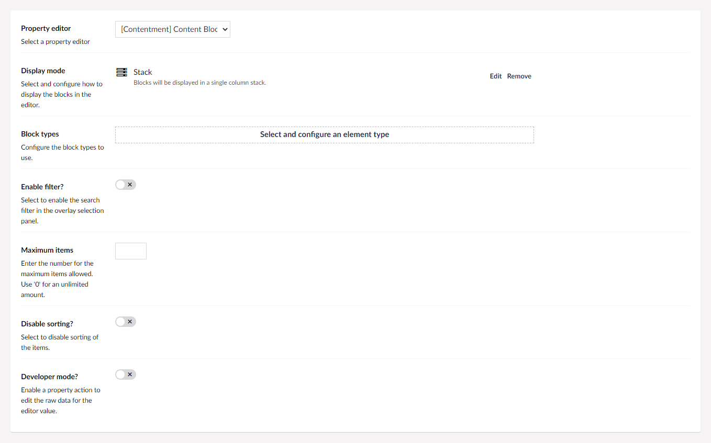
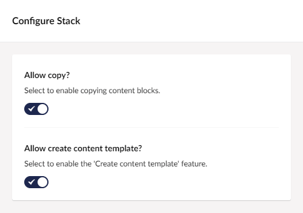
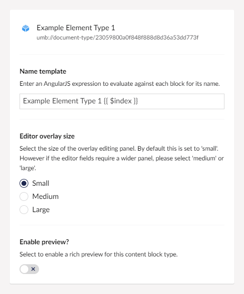
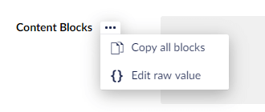

## Contentment for Umbraco

> This documentation is a _**work-in-progress.**_ There will be plot holes and missing pieces. Please bear with me.

### Content Blocks

Content Blocks is a property-editor used for creating a list of structured content, with each block configurable using an element type.

> If you are using Umbraco 8.7 (or above), this may sound familiar to the [Block List Editor](https://our.umbraco.com/Documentation/Getting-Started/Backoffice/Property-Editors/Built-in-Property-Editors/Block-List-Editor/), and you may be asking yourself why should you use Content Blocks over the built-in Block List Editor? It's a good question, and you'll find no marketing spin from me, I'd recommend that you stick with Umbraco's built-in editors. Content Blocks has subtle differences, it's entirely your choice.

> For long time fans of Umbraco v7.x, if you recall the [Stacked Content](https://our.umbraco.com/packages/backoffice-extensions/stacked-content) editor, then Content Blocks could be considered its spiritual successor.

### How to configure the editor?

In your new Data Type, selected the "[Contentment] Content Blocks" option. You will see the following configuration fields.

The two main fields are "**Display mode**" and "**Block types**", the rest are for further configuration.

The **Display mode** is pre-configured to use the **Stack** mode, this enables a richer editing experience. Alternatively, if you prefer to use an interface similar to Umbraco's Content Picker editor, you can remove the **Stack** configuration and use the **List** mode instead. Each display mode comes with their own configuration options, _e.g. the Stack mode has a feature to create a **Content template** from each block item._

> **Note:** You can add your own custom display modes by implementing the [`IContentBlocksDisplayMode`](https://github.com/leekelleher/umbraco-contentment/blob/develop/src/Umbraco.Community.Contentment/DataEditors/ContentBlocks/IContentBlocksDisplayMode.cs) interface.
> `// TODO: Write documentation on developing custom display modes.`

Next is to select and configure the **Block types**. By pressing the **Select and configure an element type** button, you will be presented with a selection of element types.

> **Note:** If you have not created any element types. Please refer to [Umbraco's documentation on how to create an element type](https://our.umbraco.com/documentation/Getting-Started/Data/Defining-content/).

Once you have selected an element type, you will be presented with the configuration options for that block type.

The **Name template**  field can be used to enter an AngularJS expression, which is evaluated against each block (of this type) to display its name. If this field is left empty, the default name template will be `"Item {{ $index }}"`.

The **Editor overlay size** option will configure the size (width) of the overlay editing panel. The options are Small, Medium and Large. The default value is "Small", this is typically ideal for consise element types, e.g. with a heading, media picker and intro blurb textarea. For element types with heavier content, e.g. Rich Text editors, then "Medium" or "Large" would be a more suitable option.

The **Enable preview?** option can be enabled to render a richer preview of the content block item. The preview mechanism uses a Razor (`.cshtml`) partial-view for rendering.

> **Note:** For details on how to render a preview, see the [Previews](#previews) section below.

Once you have configured the block type, press the **Done** button at the bottom of the overlay.

The rest of the configuration options can give finer control over the editing experience.

The **Enable filter?** option can enable a search filer at the top of the overlay selection panel. This can be useful if you have configured many block types.

The **Maximum items** field is used to limit the number of content blocks that the editor can have. Once the maximum is reached, the **Add** button will not be available.

The **Disable sorting?** option will prevent the Content Blocks from being sorted.

Lastly, the **Developer mode?** option is a special feature for those who would like to have access to the raw JSON value of the Content Block editor. Enabling this option will add a [property action](https://our.umbraco.com/Documentation/Extending/Property-Editors/Property-Actions/) called **Edit raw value**.

Once you have configured the Data Type, press the **Save** button and add it to your Document Type.

### How to use the editor?

> Press the Add button
> 
> Select block from overlay
> 
> Edit in panel.
> 
> Options - copy block; create content template

#### Previews

> `// TODO: Write documentation about the Razor partial-view templates.`
> An example can be seen with [the default preview partial-view, `ContentBlockPreview.cshtml`](https://github.com/leekelleher/umbraco-contentment/blob/develop/src/Umbraco.Community.Contentment/DataEditors/ContentBlocks/ContentBlockPreview.cshtml).
> _Advanced usage using the `@inherits ContentBlockPreviewModel<TPublishedContent, TPublishedElement>` declaration._

> Razor views, found within the `/Views/Partials/Blocks/` folder
> 
> Mention the view-model + view-data properties (icon, index/position)
> 
> NOTE: Preview doesn't work on a new unsaved page. As it has no page context.

### How to get the value?

> `IEnumerable<IPublishedElement>`
> If using ModelsBuilder, it'll be castable to the desired element type model.

### Further reading

> Alternative block editor options (for Umbraco v8)
> - Bento editor
> - Perplex Content Blocks

- [Paul Marden's Landing Page article on Skrift](https://skrift.io/issues/part-1-landing-pages/).
